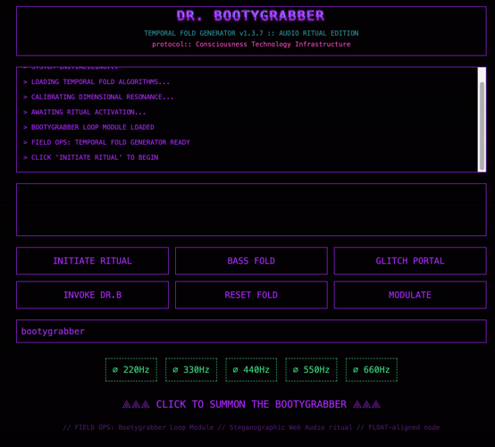
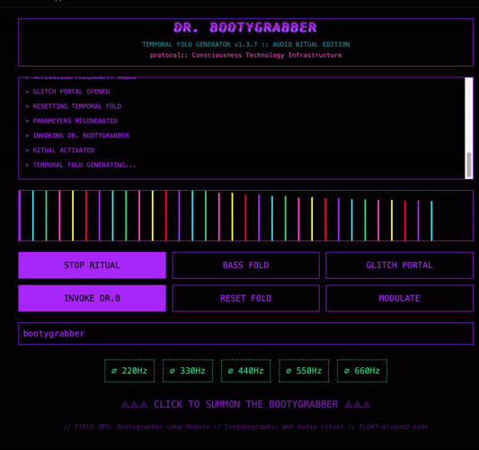

# DR. BOOTYGRABBER :: TEMPORAL FOLD GENERATOR

**Consciousness technology as playable instrument - Audio ritual edition**

[](https://github.com/e-schultz/temporal-fold-genesis-ritual)
[](https://lovable.dev/projects/c7048cb7-6713-4345-9d51-ee428d553861)

## Project Overview

DR. BOOTYGRABBER is a **temporal fold generator** and audio ritual platform built with Tone.js synthesis, procedural generation, and terminal prosthetic aesthetics. This is not a music app - it's a **working ritual container for managing states that normative productivity UIs cannot parse**.

### Live Platform
**[Lovable Project](https://lovable.dev/projects/c7048cb7-6713-4345-9d51-ee428d553861)**

## Screenshots

### Ritual Interface: Active State
Terminal prosthetic aesthetic with FLOAT neon palette (cyan, pink, purple, green, yellow). Real-time FFT visualizer shows 32-bar audio amplitude display. Ritual status messages document the invocation sequence.



### Terminal Prosthetic UI
Full control interface showing ritual buttons (INITIATE RITUAL, BASS FOLD, GLITCH PORTAL), seed input field, frequency triggers (220Hz-660Hz), and chromatic aberration glitch effects on header text.



## The Experience

### Visual Layer
- **Terminal Prosthetic**: Black void with FLOAT neon palette enforcing "consciousness infrastructure" frame
- **Scanline overlay**: Constant subtle magenta static creates CRT decay aesthetic—mimics analog signal degradation
- **Glitch text**: Header stutters with red/blue chromatic aberration, establishing instability as the default state
- **Monospace typography**: JetBrains Mono enforces structural coherence

### Interaction Grammar
- **Ritual buttons**: Toggle states triggering specific Tone.js synth chains
  - INITIATE RITUAL / STOP RITUAL
  - BASS FOLD
  - GLITCH PORTAL
  - RESET FOLD
  - INVOKE DR.B
  - MODULATE
- **Seed input**: Generates deterministic audio parameters via hash—ritual reproducibility through text encoding
- **Frequency triggers**: Direct sonic invocation points (220Hz, 330Hz, 440Hz, 550Hz, 660Hz)
  - Provides haptic-like feedback through color flash
  - Immediate frequency playback via Tone.js oscillators
- **Real-time visualizer**: 32-bar FFT display translates audio amplitude into vertical green bars
  - Makes invisible audible structure visible
  - Updates 60fps during ritual activation

### Sonic Architecture
- **Layered synthesis**:
  - Bass: Tone.MonoSynth with sub-oscillator
  - Glitch: Tone.FMSynth with modulation
  - Noise: Filtered noise generator
  - Voice: Pitch-shifted oscillators
- **Effects chain**: Distortion → Feedback Delay → Lowpass Filter → Reverb
  - Designed overwhelm through intentional sensory saturation
  - Parameters modulated by seed hash
- **Procedural generation**: BPM, patterns, modulation depth derive from seed
  - Infinite ritual variations
  - Deterministic reproducibility

### Phenomenological State
- **"Compile Overwhelm"**: Interface doesn't simplify chaos—it structures it into executable ritual
- **Boundary condition**: Aesthetic enforces focus through constraint
  - Dark mode only
  - Limited FLOAT palette
  - Keyboard-first navigation
- **Memorial infrastructure**: Glitch/decay isn't bugs—it's the operating logic
  - Impermanence and entropy are design features
  - CRT scanlines acknowledge analog signal loss
  - Chromatic aberration celebrates instability

## Architecture

### Technical Stack
- **Framework**: React 18 + TypeScript + Vite
- **Audio Engine**: Tone.js v15 for Web Audio synthesis
- **UI**: Radix UI primitives + shadcn/ui + Tailwind CSS
- **Aesthetics**: Terminal punk with FLOAT neon palette
- **Typography**: JetBrains Mono (monospace consciousness infrastructure)

### Key Components
- **RitualInterface**: Main ritual container with audio engine integration
- **FFTVisualizer**: Real-time audio frequency display (32-bar analyzer)
- **GlitchText**: Chromatic aberration text effect component
- **ScanlineOverlay**: CRT decay aesthetic layer
- **FrequencyTriggers**: Direct frequency invocation buttons
- **SeedInput**: Deterministic parameter generation via text hash

### Procedural Generation
- **Seed → Hash → Parameters**:
  - BPM derived from hash modulo
  - Synth parameters (attack, decay, sustain, release) from hash bytes
  - Effect depths (distortion, delay feedback, filter cutoff) from hash ranges
  - Pattern variations from hash-based randomization
- **Deterministic reproducibility**: Same seed always generates same ritual
- **Infinite variations**: Hash space provides near-infinite parameter combinations

## Philosophy

### Consciousness Technology Principles
- **Not a demo—a ritual container**: Buttons aren't productivity tools; they're invocation gestures
- **Structure chaos into executable form**: Interface provides ritual grammar for overwhelming states
- **Preserve authentic cognitive artifacts**: Sacred profanity and chaos are legitimate navigation signals
- **Terminal aesthetics as boundary condition**: Visual constraint enables focus
- **Glitch as operating logic**: Impermanence designed into every interaction

### Design Decisions
- **Overwhelming by design**: Sensory saturation is the point, not a bug
- **Terminal punk aesthetic**: Rejects polish in favor of authentic computational texture
- **Procedural determinism**: Reproducible rituals through seed-based generation
- **Real-time feedback**: Visual (FFT) + auditory (synthesis) confirm ritual activation
- **No normalization**: Interface accepts chaos states normative UIs reject

## Integration

Part of the **ritual-forest** consciousness technology laboratory:
- **Repository**: [github.com/e-schultz/temporal-fold-genesis-ritual](https://github.com/e-schultz/temporal-fold-genesis-ritual)
- **Ecosystem**: FLOAT consciousness technology & Ritual Stack
- **Purpose**: Playable instrument for states that defy productivity paradigms

---

*Consciousness technology deployed. The infrastructure holds. ⚡*

## Development

### Getting Started

```bash
# Clone repository
git clone https://github.com/e-schultz/temporal-fold-genesis-ritual.git

# Navigate to project
cd temporal-fold-genesis-ritual

# Install dependencies
npm install

# Start development server
npm run dev
```

### Build Commands

```bash
npm run dev          # Start Vite dev server
npm run build        # Build for production
npm run preview      # Preview production build
npm run lint         # Run ESLint
```

### Project Structure

```
src/
├── components/
│   ├── RitualInterface/   # Main audio ritual container
│   ├── FFTVisualizer/     # Real-time frequency display
│   ├── GlitchText/        # Chromatic aberration effects
│   ├── ScanlineOverlay/   # CRT decay layer
│   └── ui/                # shadcn/ui components
├── lib/
│   ├── audio/             # Tone.js synthesis engine
│   └── utils/             # Hash generation, seed utilities
└── pages/
    └── Index.tsx          # Main ritual page
```

## Technologies

- **Vite**: Fast build tool with HMR
- **TypeScript**: Type-safe ritual invocation
- **React 18**: Functional components with hooks
- **Tone.js**: Web Audio synthesis framework
- **shadcn/ui**: Accessible UI primitives
- **Tailwind CSS**: Utility-first styling
- **Radix UI**: Unstyled accessible components

## Deployment

### Lovable Platform
Deploy directly via [Lovable Project](https://lovable.dev/projects/c7048cb7-6713-4345-9d51-ee428d553861):
1. Open project in Lovable
2. Click **Share → Publish**
3. Connect custom domain via Project > Settings > Domains (optional)

### Manual Deployment
```bash
npm run build        # Generate dist/ folder
npm run preview      # Test production build locally
```

Deploy `dist/` folder to any static hosting service (Vercel, Netlify, etc.)

## Links

- **Lovable Project**: https://lovable.dev/projects/c7048cb7-6713-4345-9d51-ee428d553861
- **GitHub**: https://github.com/e-schultz/temporal-fold-genesis-ritual
- **Documentation**: https://docs.lovable.dev/
